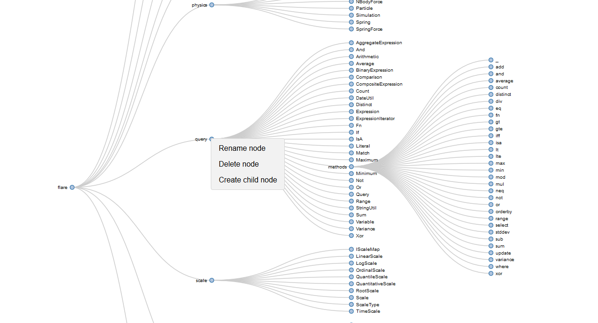
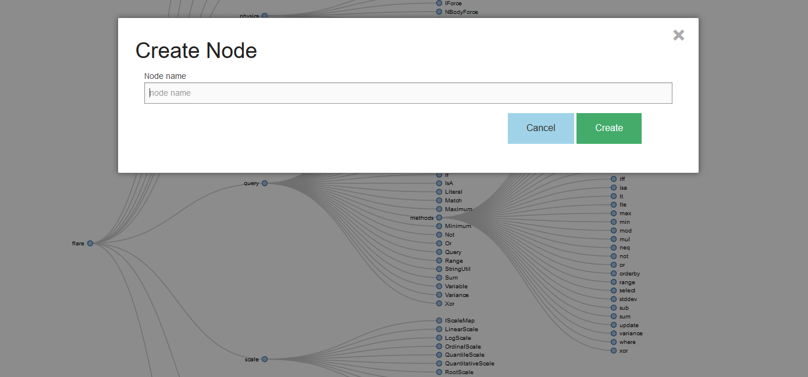

# Dendogram
A dendrogram (from Greek dendro "tree" and gramma "drawing") is a tree diagram frequently used to illustrate the arrangement of the clusters produced by hierarchical clustering.
____

Dendogram on your browser ready to use, no deep sh*t. Just open your browser and done. You do not have to install anything.

## Source
Based on [Adam Feuer’s post]: d3js tree editor with node create, delete, and rename

## Screenshots

## Demo
[Live demo]

[Live demo]: http://bl.ocks.org/adamfeuer/raw/042bfa0dde0059e2b288/

[Adam Feuer’s post]: https://bl.ocks.org/adamfeuer/042bfa0dde0059e2b288
